# DANH SÁCH MÀN HÌNH HỆ THỐNG - VIEC24H PLATFORM

> Tài liệu kỹ thuật liệt kê toàn bộ screens/pages của hệ thống.

---

## TỔNG QUAN

| Nhóm | Số màn hình | Layout |
|------|-------------|--------|
| Public | 6 | App |
| Auth Candidate | 6 | App |
| Candidate | 14 | App |
| Auth Employer | 7 | EmployerLayout |
| Employer | 13 | EmployerLayout |
| Admin | 7 | AdminLayout |
| **TỔNG** | **52** | |

---

## DANH SÁCH CHI TIẾT

### Public Screens
| Route | Màn hình |
|-------|----------|
| `/` | Trang chủ |
| `/jobs` | Danh sách việc làm |
| `/jobs/:id` | Chi tiết việc làm |
| `/companies` | Danh sách công ty |
| `/companies/:id` | Chi tiết công ty |
| `/skills` | Kỹ năng |

### Candidate Auth
| Route | Màn hình |
|-------|----------|
| `/login` | Đăng nhập |
| `/register` | Đăng ký |
| `/auth/callback` | OAuth Callback |
| `/forgot-password` | Quên mật khẩu |
| `/reset-password` | Đặt lại mật khẩu |
| `/verify-email` | Xác thực email |

### Candidate Protected
| Route | Màn hình |
|-------|----------|
| `/user/dashboard` | Tổng quan |
| `/user/profile` | Hồ sơ cá nhân |
| `/user/resumes` | Danh sách CV |
| `/user/resumes/create` | Tạo CV |
| `/user/resumes/:id` | Xem CV |
| `/user/resumes/:id/edit` | Sửa CV |
| `/user/applications` | Việc đã ứng tuyển |
| `/user/applications/:id` | Chi tiết đơn |
| `/user/saved-jobs` | Việc đã lưu |
| `/user/saved-searches` | Tìm kiếm đã lưu |
| `/user/notifications` | Thông báo |
| `/user/job-notifications` | TB việc làm |
| `/user/settings` | Cài đặt |

### Employer Auth
| Route | Màn hình |
|-------|----------|
| `/employer` | Landing |
| `/employer/login` | Đăng nhập |
| `/employer/register` | Đăng ký |
| `/employer/forgot-password` | Quên mật khẩu |
| `/employer/auth/callback` | OAuth Callback |
| `/employer/about` | Giới thiệu |
| `/employer/contact` | Liên hệ |

### Employer Protected
| Route | Màn hình |
|-------|----------|
| `/employer/dashboard` | Dashboard |
| `/employer/profile` | Hồ sơ cá nhân |
| `/employer/company` | Hồ sơ công ty |
| `/employer/jobs` | DS tin tuyển dụng |
| `/employer/jobs/create` | Tạo tin mới |
| `/employer/jobs/:id/edit` | Sửa tin |
| `/employer/applications` | DS ứng viên |
| `/employer/applications/:id` | Chi tiết đơn |
| `/employer/candidates/:id` | Hồ sơ ứng viên |
| `/employer/saved-candidates` | Ứng viên đã lưu |
| `/employer/analytics` | Analytics |
| `/employer/notifications` | Thông báo |
| `/employer/settings` | Cài đặt |

### Admin
| Route | Màn hình |
|-------|----------|
| `/admin/login` | Đăng nhập |
| `/admin/dashboard` | Dashboard |
| `/admin/users` | Quản lý Users |
| `/admin/employers` | Quản lý Employers |
| `/admin/companies` | Quản lý Companies |
| `/admin/jobs` | Quản lý Jobs |
| `/admin/notifications` | Quản lý Thông báo |

---

## MERMAID DIAGRAM - SCREEN FLOW TỔNG HỢP

```mermaid
flowchart TB
    %% ==================== ENTRY POINTS ====================
    Start([User truy cap])
    Start --> PublicHome
    Start --> EmpLanding
    Start --> AdminLogin
    
    %% ==================== PUBLIC AREA ====================
    subgraph Public[PUBLIC SCREENS]
        PublicHome[Trang chu<br/>fa:fa-home /]
        JobList[DS viec lam<br/>/jobs]
        JobDetail[Chi tiet job<br/>/jobs/:id]
        CompanyList[DS cong ty<br/>/companies]
        CompanyDetail[Chi tiet cong ty<br/>/companies/:id]
        SkillsPage[Ky nang<br/>/skills]
    end
    
    PublicHome --> JobList
    PublicHome --> CompanyList
    PublicHome --> SkillsPage
    JobList --> JobDetail
    CompanyList --> CompanyDetail
    
    %% ==================== CANDIDATE AUTH ====================
    subgraph CandidateAuth[CANDIDATE AUTH]
        CLogin[Dang nhap<br/>/login]
        CRegister[Dang ky<br/>/register]
        CForgot[Quen MK<br/>/forgot-password]
        CReset[Dat lai MK<br/>/reset-password]
        CVerify[Xac thuc email<br/>/verify-email]
        CCallback[OAuth<br/>/auth/callback]
    end
    
    PublicHome --> CLogin
    PublicHome --> CRegister
    CLogin --> CForgot
    CForgot --> CReset
    CRegister --> CVerify
    CLogin --> CCallback
    
    %% ==================== CANDIDATE PROTECTED ====================
    subgraph Candidate[CANDIDATE SCREENS - Protected]
        CDash[Tong quan<br/>/user/dashboard]
        CProfile[Ho so<br/>/user/profile]
        CResumeList[DS CV<br/>/user/resumes]
        CResumeCreate[Tao CV<br/>/user/resumes/create]
        CResumeView[Xem CV<br/>/user/resumes/:id]
        CResumeEdit[Sua CV<br/>/user/resumes/:id/edit]
        CApps[Viec da ung tuyen<br/>/user/applications]
        CAppDetail[Chi tiet don<br/>/user/applications/:id]
        CSavedJobs[Viec da luu<br/>/user/saved-jobs]
        CSavedSearch[Tim kiem da luu<br/>/user/saved-searches]
        CNotif[Thong bao<br/>/user/notifications]
        CJobNotif[TB viec lam<br/>/user/job-notifications]
        CSettings[Cai dat<br/>/user/settings]
    end
    
    CLogin --> |Thanh cong| CDash
    CCallback --> CDash
    
    CDash --> CProfile
    CDash --> CResumeList
    CDash --> CApps
    CDash --> CSavedJobs
    CDash --> CSavedSearch
    CDash --> CNotif
    CDash --> CJobNotif
    CDash --> CSettings
    
    CResumeList --> CResumeCreate
    CResumeList --> CResumeView
    CResumeView --> CResumeEdit
    CApps --> CAppDetail
    
    JobDetail --> |Ung tuyen| CApps
    JobDetail --> |Luu| CSavedJobs
    
    %% ==================== EMPLOYER AUTH ====================
    subgraph EmployerAuth[EMPLOYER AUTH]
        EmpLanding[Landing<br/>/employer]
        ELogin[Dang nhap<br/>/employer/login]
        ERegister[Dang ky<br/>/employer/register]
        EForgot[Quen MK<br/>/employer/forgot-password]
        ECallback[OAuth<br/>/employer/auth/callback]
        EAbout[Gioi thieu<br/>/employer/about]
        EContact[Lien he<br/>/employer/contact]
    end
    
    EmpLanding --> ELogin
    EmpLanding --> ERegister
    EmpLanding --> EAbout
    EmpLanding --> EContact
    ELogin --> EForgot
    ELogin --> ECallback
    
    %% ==================== EMPLOYER PROTECTED ====================
    subgraph Employer[EMPLOYER SCREENS - Protected]
        EDash[Dashboard<br/>/employer/dashboard]
        EProfile[Ho so<br/>/employer/profile]
        ECompany[Ho so cong ty<br/>/employer/company]
        EJobList[DS tin TD<br/>/employer/jobs]
        EJobCreate[Tao tin<br/>/employer/jobs/create]
        EJobEdit[Sua tin<br/>/employer/jobs/:id/edit]
        EAppList[DS ung vien<br/>/employer/applications]
        EAppDetail[Chi tiet don<br/>/employer/applications/:id]
        ECandidateView[Ho so UV<br/>/employer/candidates/:id]
        ESavedCand[UV da luu<br/>/employer/saved-candidates]
        EAnalytics[Analytics<br/>/employer/analytics]
        ENotif[Thong bao<br/>/employer/notifications]
        ESettings[Cai dat<br/>/employer/settings]
    end
    
    ELogin --> |Thanh cong| EDash
    ECallback --> EDash
    
    EDash --> EProfile
    EDash --> ECompany
    EDash --> EJobList
    EDash --> EAppList
    EDash --> ESavedCand
    EDash --> EAnalytics
    EDash --> ENotif
    EDash --> ESettings
    
    EJobList --> EJobCreate
    EJobList --> EJobEdit
    EAppList --> EAppDetail
    EAppDetail --> ECandidateView
    ECandidateView --> ESavedCand
    
    %% ==================== ADMIN ====================
    subgraph Admin[ADMIN SCREENS - Protected]
        AdminLogin[Dang nhap<br/>/admin/login]
        ADash[Dashboard<br/>/admin/dashboard]
        AUsers[Quan ly Users<br/>/admin/users]
        AEmployers[Quan ly Employers<br/>/admin/employers]
        ACompanies[Quan ly Companies<br/>/admin/companies]
        AJobs[Quan ly Jobs<br/>/admin/jobs]
        ANotif[Quan ly TB<br/>/admin/notifications]
    end
    
    AdminLogin --> |Thanh cong| ADash
    
    ADash --> AUsers
    ADash --> AEmployers
    ADash --> ACompanies
    ADash --> AJobs
    ADash --> ANotif
    
    %% ==================== CROSS FLOWS ====================
    AEmployers -.-> |Verify| EDash
    AJobs -.-> |Moderate| EJobList
```

---

## HƯỚNG DẪN SỬ DỤNG

1. Copy code Mermaid trong block ở trên
2. Paste vào [Mermaid Live Editor](https://mermaid.live)
3. Export PNG/SVG từ menu Actions

---

*Generated from source code - viec24h Platform*
